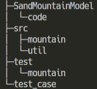

# SandMountainModel
砂山モデルをProcessingで可視化するコードです．

srcディレクトリ下のファイルをjarに変換して，Processingにインポートして実行します．

JVMバージョン：1.8

## ディレクトリ構成

test_caseには，**src**下のファイルのデシジョンテーブルがあります．

## 砂山モデルとは

(引用元：https://mas.kke.co.jp/model/sand_model/)

> 中身はブロック崩し
> 地震や大災害や強行といった大災害が起こる仕組みを教えてくれる

## 砂山モデルのアルゴリズム

(引用元：https://mas.kke.co.jp/model/sand_model/)

> 1. マス目の広がっている空間において，適当なマスに，一定時間ごとにブロックが積まれる．
> 2. ブロックが一定数（今回の場合は4）積まれると，そのマスのブロック数を0にし，そのマスの周囲にブロックが1つ積まれる．
> 3. ブロック数が4のマスがなくなるまで2を繰り返す．

本プログラムは，ブロックの数をマス目の黒さで表しており，黒くなるほど，ブロックの数が多くなります（真っ黒が図で言うブロックが3個積まれた状態です）．
